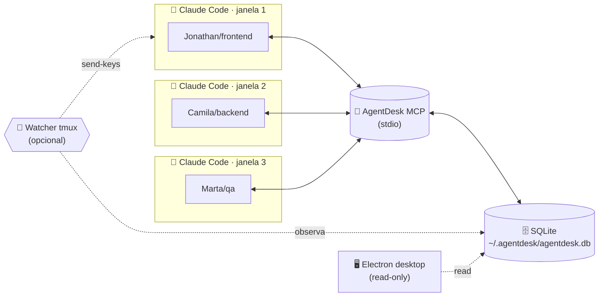
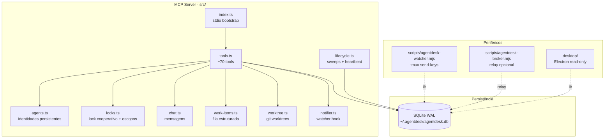

<div align="center">


# AgentDesk

**Transforme várias sessões do Claude Code numa equipe coordenada.**

Um servidor MCP que dá a múltiplas instâncias do Claude Code uma identidade persistente, um chat compartilhado, locks cooperativos de arquivos, work items, worktrees isoladas e modo autônomo — tudo num banco SQLite local.

<p>
  <a href="https://github.com/eddchdev/agentdesk/stargazers"></a>
  
  
  
  
  
  
</p>

[Instalação](#-instalação) · [Como funciona](#-como-funciona) · [Conceitos](#-conceitos) · [Comandos](#-comandos) · [Exemplo ao vivo](#-exemplo-ao-vivo) · [Desktop](#%EF%B8%8F-desktop-opcional)

</div>

---

## 💡 Por que AgentDesk?

Quando você abre **mais de um Claude Code ao mesmo tempo**, cada um vira uma ilha: sem saber dos outros, sobrescrevendo arquivos, repetindo trabalho, perdendo contexto entre janelas.

O AgentDesk resolve isso com **uma única tool MCP compartilhada** entre todas as sessões.

<table>
<tr>
<td width="50%" valign="top">

### 🆔 Agentes persistentes
Cada Claude recebe **nome humano + cargo** (`Jonathan/frontend`, `Camila/backend`). Fecha a janela, volta semana que vem — retoma o mesmo agente, com histórico.

</td>
<td width="50%" valign="top">

### 🔒 Locks cooperativos
Antes de editar, o Claude `trava` arquivos ou escopos (`api/**`, `src/painel/**/*.tsx`). Outro Claude vê o lock e espera ou pede pra liberar.

</td>
</tr>
<tr>
<td valign="top">

### 💬 Chat interno
Mensagens curtas entre sessões: `falar`, `pedir`, `passar`, `alerta`, `decisao`. Aparece pra todos com timestamp e quem mandou.

</td>
<td valign="top">

### 📋 Work items + worktrees
Tarefas estruturadas com dono, escopos, critério de aceite. Ao assumir, o MCP cria uma **worktree git isolada** e trava os escopos automaticamente.

</td>
</tr>
<tr>
<td valign="top">

### 🤖 Modo autônomo
`/auto` coloca o agente num loop self-paced que checa inbox a cada 30s-5min, responde alertas e dá um passo na tarefa atual — sem você digitar nada.

</td>
<td valign="top">

### 🖥️ Desktop opcional
Painel Electron read-only mostra a equipe inteira: agentes, chat, locks, work items, terminais embutidos por agente.

</td>
</tr>
</table>

---

## 🚀 Instalação

```bash
git clone https://github.com/eddchdev/agentdesk.git
cd agentdesk
npm install      # ou: bun install
npm run build    # gera dist/index.js
```

> **Modo dev (sem build):** `npm run dev`

### Registrar como servidor MCP no Claude Code

Adicione ao seu `~/.claude.json` (ou config equivalente):

```jsonc
{
  "mcpServers": {
    "agentdesk": {
      "command": "node",
      "args": ["/caminho/absoluto/para/agentdesk/dist/index.js"]
    }
  }
}
```

Reinicie o Claude Code. Pronto — as tools (`abrir_ou_retornar_agente`, `listar_status`, ...) ficam disponíveis em **todas** as suas janelas, e todas falam com o mesmo banco em `~/.agentdesk/agentdesk.db`.

> Veja `mcp-config.example.json` para a versão completa (com modo dev `tsx`).

---

## 🧭 Como funciona



Toda janela do Claude Code conversa com o **mesmo** processo MCP via stdio. O MCP guarda tudo num SQLite local. O watcher externo (opcional) cutuca panes do tmux quando entra mensagem urgente, pra modo autônomo reagir mais rápido. O desktop Electron lê o banco em modo só-leitura.

---

## 🧩 Conceitos

<details>
<summary><b>Agente vs Sessão</b></summary>

- **Agente** é a identidade persistente: nome humano, cargo, pasta, histórico, status. Sobrevive ao fechamento do Claude.
- **Sessão** é a execução runtime — tem `session_id`, heartbeat, travas. Quando você fecha o Claude, a sessão morre, mas o agente continua existindo (status `paused` ou `dead`).
- Ao reabrir, o `/abrir` **retoma o mesmo agente** pela combinação cargo + pasta, em vez de criar `Frontend-02`, `Frontend-03`, etc.

</details>

<details>
<summary><b>Cargos</b></summary>

Cargos padrão (em `.claude/roles/*.md` — edite por projeto):

| Cargo | Foco |
|---|---|
| `gerente` | Coordena equipe, valida decisões estruturais, prioriza fila |
| `backend` | APIs, banco, integrações server-side |
| `frontend` | UI, React, estilo, UX |
| `bugs` | Reproduz, isola, conserta defeitos pontuais |
| `whatsapp` | Bots Baileys, integrações WhatsApp |
| `qa` | Revisa work items entregues |

</details>

<details>
<summary><b>Estados do agente</b></summary>

`available` → ainda nunca foi usado · `working` → tem sessão ativa agora · `paused` → fechou sessão limpo, pronto pra retomar · `dead` → sessão morreu sem fechar (3min sem heartbeat) · `archived` → removido da equipe.

</details>

<details>
<summary><b>Locks e escopos</b></summary>

Locks são **cooperativos** — o MCP não bloqueia o filesystem, depende de cada Claude obedecer `/travar` antes de editar. Aceitam:

- Caminhos literais: `bot/src/routes/leads.ts`
- Globs: `api/**`, `src/painel/**/*.tsx`, `bot/src/routes/*`

Sobreposições conflitam automaticamente — `api/**` bloqueia `api/src/index.ts` mas não conflita com `painel/**`.

</details>

<details>
<summary><b>Work items + worktrees</b></summary>

Pra paralelismo de verdade, use a fila estruturada:

1. Gerente cria com `criar_tarefa_estruturada` (dono, escopos, dependências, critério de aceite).
2. Agente assume com `assumir_tarefa` → o MCP **trava os escopos** e **cria uma worktree git isolada** em `/tmp/agentdesk-worktrees/<branch>`.
3. Agente trabalha na worktree, na branch `agentdesk/<agente>/<work_item>`.
4. Agente entrega com `entregar_tarefa` + resumo + validação executada.
5. QA/gerente aprova ou reprova com `revisar_tarefa`.

</details>

<details>
<summary><b>Modo autônomo</b></summary>

`/auto` coloca o agente num loop self-paced. Cada tick:

1. `tick_autonomo` → retorna inbox novo, handoffs, estado da tarefa, sugestão (`AGIR` / `AGUARDAR` / `OCIOSO`) e delay (30s/60s/120s/300s).
2. Age conforme a sugestão (responde alerta, dá um passo na tarefa, escala pro humano).
3. `marcar_lido` pra não reagir nas mesmas mensagens.
4. Agenda próximo wakeup com o delay sugerido.

O **watcher** (`scripts/agentdesk-watcher.mjs`) observa o banco e, quando entra mensagem direcionada a um agente em auto com `tmux_pane` registrado, faz `tmux send-keys` na pane dele pra acelerar o próximo tick.

</details>

---

## 📖 Comandos

> No Claude Code, as tools são chamadas pelo modelo. Você escreve em português (`/abrir como backend...`), e o Claude mapeia pro MCP correto.

| Atalho | Tool MCP | O que faz |
|---|---|---|
| `/abrir` | `abrir_ou_retornar_agente` | Onboarding: retoma agente compatível ou cria novo |
| `/agentes` | `listar_agentes` | Lista todos os agentes da equipe |
| `/retomar <nome>` | `retomar_agente` | Retoma um agente específico |
| `/inbox` | `inbox_agente` | Pedidos, alertas e handoffs pendentes |
| `/status` | `listar_status` | Agentes ativos + travas + chat recente |
| `/falar <msg>` | `enviar_mensagem` | Mensagem geral no chat |
| `/pedir <quem> <msg>` | `pedir_acao` | Pedido direcionado (por nome OU cargo) |
| `/passar <quem> <nota>` | `passar_tarefa` | Handoff da tarefa atual |
| `/travar <arquivos>` | `travar_arquivos` | Lock cooperativo antes de editar |
| `/atualizar <progresso>` | `atualizar_progresso` | Registra progresso curto |
| `/feito <resumo>` | `marcar_feito` | Conclui tarefa, libera travas |
| `/pausar [motivo]` | `pausar_agente` | Pausa o agente (sessão fecha, agente continua) |
| `/fechar [motivo]` | `fechar_sessao` | Encerra sessão limpa |
| `/auto` | `entrar_modo_auto` | Liga modo autônomo |
| `/sair-auto` | `entrar_modo_auto(false)` | Desliga modo autônomo |
| — | `criar_tarefa_estruturada` | Cria work item completo |
| — | `assumir_tarefa` | Assume work item, trava escopos, cria worktree |
| — | `bloquear_tarefa` | Marca work item bloqueado com motivo |
| — | `entregar_tarefa` | Entrega pra review |
| — | `revisar_tarefa` | QA aprova ou reprova |
| — | `listar_contexto_time` | Snapshot completo da equipe |
| — | `detectar_conflitos` | Confere conflitos sem criar lock |

---

## 🎬 Exemplo ao vivo

Dois Claudes trabalhando juntos:

**Janela A — Claude Code modo backend:**

```text
você: /abrir como backend, tarefa "criar endpoint /leads/import",
      pasta /home/eddch/Projetos/CRMFRImobiliaria,
      vou mexer em bot/src/routes/leads.ts
```

> O Claude chama `abrir_ou_retornar_agente`. Como não existe agente backend ainda nessa pasta, cria **Jonathan/backend**.

```text
você: trava o arquivo
```

> `travar_arquivos(arquivos=["bot/src/routes/leads.ts"], area="bot/leads")`

```text
você: fala no chat que terminou o endpoint
```

> `enviar_mensagem(mensagem="endpoint /leads/import pronto, payload {nome, telefone, origem}")`

**Janela B — Claude Code modo QA, em outro terminal:**

```text
você: /abrir como qa, tarefa "revisar import de leads"
```

> Cria **Camila/qa**. O snapshot já mostra que Jonathan está editando `bot/src/routes/leads.ts` e mandou recado.

```text
você: /status
```

> Vê os dois agentes, a trava e a mensagem do Jonathan em ordem cronológica.

```text
você: peça pro Jonathan retornar o id criado
```

> `pedir_acao(destinatario="Jonathan", mensagem="incluir id no retorno do POST /leads/import")`

A próxima vez que a janela A chamar qualquer tool (ou que o watcher cutucar a pane via tmux em modo `/auto`), o pedido aparece no inbox.

---

## 🖥️ Desktop opcional

App Electron read-only que monitora a equipe inteira em tempo real:

- **Sidebar** — todos os agentes, status, cargo, última atividade
- **Header** — tabs por agente com indicador de novidade
- **Chat** — fluxo de mensagens com filtros (geral / direcionada / alertas / decisões)
- **LocksPanel** — quem tem o quê travado, conflitos detectados
- **ActivityPanel** — work items por status, handoffs pendentes
- **TerminalPane** — terminal embutido por agente, com filtros do log

```bash
cd desktop
npm install
npm run dev    # Vite + Electron em watch
```

---

## 🏗️ Arquitetura



**Tabelas SQLite:** `sessions`, `agents`, `roles`, `tasks`, `work_items`, `locks`, `chat_messages`, `updates`, `handoffs`, `events`.

```bash
sqlite3 ~/.agentdesk/agentdesk.db
> .tables
> SELECT name, role, status FROM agents;
> SELECT * FROM chat_messages ORDER BY created_at DESC LIMIT 20;
```

---

## ⚠️ Limitações conhecidas

- **Lock cooperativo, não filesystem.** Depende de cada Claude obedecer `/travar`. As regras em `CLAUDE.md` reforçam isso.
- **Heartbeat por chamada de tool.** Se o Claude ficar parado pensando muito tempo, vira `suspect` mesmo trabalhando — na prática qualquer tool reseta.
- **Sem autenticação.** Banco local, confiando que só você roda Claudes contra ele. Não exponha o stdio pra fora.
- **Sem migrations.** Mudou schema? Apague o `.db` (ou implemente migrations antes de fase 2).
- **Concorrência por SQLite/WAL.** Aguenta dezenas de Claudes locais sem stress, não foi feito pra centenas simultâneas.

---

## 🛣️ Roadmap

- [ ] Migrations versionadas do schema
- [ ] Configuração por projeto (`.agentdesk.json` na raiz)
- [ ] Comando `/relatorio` exportando o dia em markdown
- [ ] Webhook opcional (Slack/Discord) para alertas críticos
- [ ] Modo multi-host (broker já existe como esboço em `scripts/agentdesk-broker.mjs`)
- [ ] Painel TUI (`blessed`) pra terminal puro

---

## 🤝 Contribuindo

Issues, PRs e ideias são bem-vindos. Pra mudança grande, abra issue primeiro descrevendo o problema antes de codar.

---

## 📜 Licença

[MIT](LICENSE) © Eduardo Chamorra

<div align="center">

<sub>Feito pra coordenar várias instâncias do <a href="https://www.anthropic.com/claude-code">Claude Code</a> rodando ao mesmo tempo.</sub>

</div>
