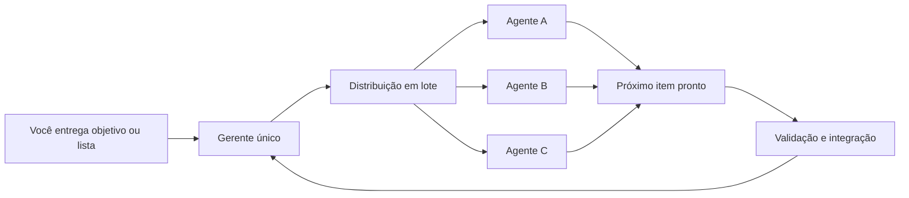
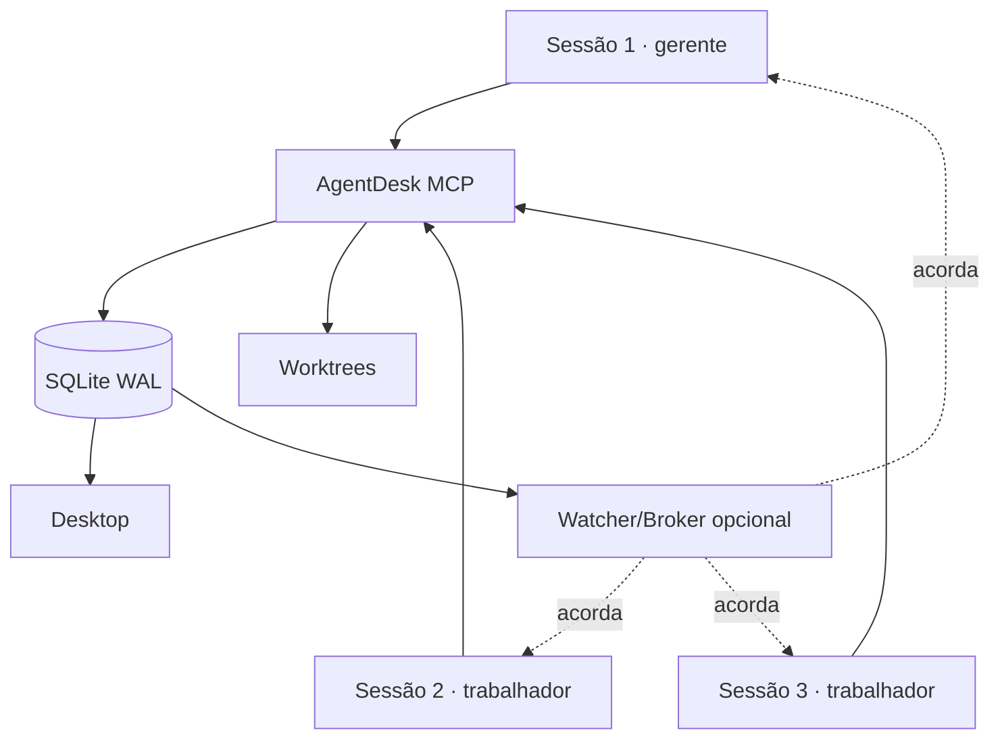

<div align="center">


# AgentDesk

**Abra as sessões. Entregue a lista ao gerente. A equipe executa em paralelo.**

Um servidor MCP local para transformar várias sessões de agente em uma equipe autônoma: gerente único por escopo, papéis dinâmicos, distribuição de tarefas em lote, locks cooperativos, worktrees e contexto incremental em SQLite.

<p>
  <a href="https://github.com/eddchdev/agentdesk/stargazers"></a>
  
  
  
  
</p>

[Início rápido](#-início-rápido) · [Fluxo autônomo](#-fluxo-autônomo) · [Papéis dinâmicos](#-papéis-dinâmicos) · [Tools](#-tools-mcp) · [Desktop](#%EF%B8%8F-desktop-opcional)

</div>

---

## O que mudou

O fluxo principal não pede mais que você monte a equipe cargo por cargo nem fique aprovando cada próximo passo.

- Toda janela começa apenas com **`/abrir`**.
- A primeira sessão do escopo vira o **gerente único**; as demais entram como **disponíveis**.
- Todas entram em modo autônomo no onboarding. Não é necessário ligar `/auto` separadamente.
- O gerente atribui um **papel livre e temporário** a cada agente conforme o trabalho real.
- Você pode entregar uma lista inteira ao gerente; ele cria e distribui os work items em lote.
- Ao terminar ou bloquear uma tarefa, o trabalhador procura a próxima tarefa pronta. Ele não fica parado esperando revisão ou uma decisão rotineira do gerente.

“Gerente” é autoridade de coordenação. “Papel” é a especialidade atual. Os dois conceitos não são mais misturados.

---

## 🚀 Início rápido

### 1. Instale

```bash
git clone https://github.com/eddchdev/agentdesk.git
cd agentdesk
npm install
npm run build
```

Requer Node.js 18 ou superior.

### 2. Registre o MCP

Adicione ao `~/.claude.json` ou à configuração equivalente:

```jsonc
{
  "mcpServers": {
    "agentdesk": {
      "command": "node",
      "args": ["/caminho/absoluto/para/agentdesk/dist/index.js"]
    }
  }
}
```

Reinicie o cliente. O banco compartilhado fica em `~/.agentdesk/agentdesk.db`.

> Para desenvolvimento sem build, veja `mcp-config.example.json`.

### 3. Abra a equipe

Na primeira janela, dentro da pasta do projeto:

```text
você: /abrir
```

O AgentDesk cria ou retoma o gerente daquele escopo e já ativa o modo autônomo.

Abra quantas janelas adicionais quiser, na mesma pasta, e diga a mesma coisa em cada uma:

```text
você: /abrir
```

Cada nova sessão entra como agente disponível. O gerente enxerga a capacidade nova, atribui o papel apropriado e inclui o agente no trabalho sem exigir configuração manual de cargo.

### 4. Dê a lista ao gerente uma vez

Na janela do gerente, use linguagem natural:

```text
Implemente esta lista usando a equipe em paralelo:

1. criar o endpoint de importação de leads;
2. montar a tela de pré-visualização;
3. cobrir regras de duplicidade com testes;
4. revisar a integração e validar o fluxo completo.

Evite conflito de arquivos e me avise apenas se houver uma decisão irreversível.
```

O gerente transforma a lista em work items, identifica dependências e escopos, atribui papéis e distribui o lote entre os agentes menos carregados.

> O MCP **não inicia processos do Claude Code nem cria capacidade de agente**. Você abre a quantidade de janelas que deseja usar; a partir daí o gerente coordena essas sessões.

---

## ⚡ Fluxo autônomo



Cada trabalhador segue este ciclo:

1. Recebe somente as mudanças novas do inbox e da fila.
2. Assume automaticamente o próximo work item pronto que lhe foi atribuído.
3. Trava os escopos necessários e usa worktree quando configurada.
4. Executa, valida e entrega o resultado.
5. Procura imediatamente outro item pronto, sem esperar a revisão anterior.

Se houver bloqueio real, o agente registra causa e evidência, libera o que não precisa mais ficar travado, avisa o gerente e continua em outro item independente. O gerente replaneja de forma assíncrona.

### O que o agente decide sozinho

- escolhas locais, reversíveis e dentro do critério de aceite;
- organização interna, testes e pequenos refactors no próprio escopo;
- ordem de execução entre itens independentes;
- correções necessárias para fazer a validação passar.

### O que deve ser escalado

- ação destrutiva ou difícil de reverter;
- mudança de produto que altera o objetivo ou o critério de aceite;
- segredo, credencial, publicação ou efeito externo sem autorização;
- conflito de escopo que não possa ser resolvido por redistribuição;
- falta de informação que permita resultados materialmente diferentes.

Essa fronteira evita dois extremos: agentes passivos pedindo permissão para tudo e agentes tomando decisões de alto impacto sem contexto.

---

## 🧭 Papéis dinâmicos

Não existe catálogo obrigatório de `backend`, `frontend`, `qa`, `bugs` ou qualquer outro cargo.

O gerente pode atribuir descrições que façam sentido para a tarefa atual, por exemplo:

- `API de importação e schema`;
- `UX da pré-visualização`;
- `investigação de duplicidades`;
- `revisor da integração`.

O papel pode mudar no próximo lote. Ele serve para informar foco e facilitar roteamento; não concede autoridade de gerente. A identidade humana do agente continua persistente entre sessões.

| Conceito | Função |
|---|---|
| Autoridade | Define quem coordena. Há um gerente por escopo; os demais são trabalhadores. |
| Papel atual | Texto livre atribuído pelo gerente para comunicar o foco do agente. |
| Agente | Identidade persistente, com nome, histórico, pasta e progresso. |
| Sessão | Execução atual, com `session_id`, heartbeat e locks. |
| Work item | Unidade executável com dono, dependências, escopos e aceite. |

O escopo normalmente é a pasta de trabalho/projeto. A eleição do gerente é protegida contra concorrência: duas janelas abertas ao mesmo tempo não devem criar dois gerentes para o mesmo escopo.

---

## 📦 Distribuição de uma lista

A tool `distribuir_tarefas` recebe o lote completo. Cada entrada pode informar título, descrição, aceite, prioridade, dependências, arquivos ou escopos pretendidos, papel desejado e destinatário explícito.

Quando o destinatário não é informado, o gerente distribui considerando disponibilidade, carga atual e papel. Os escopos declarados alimentam os locks antes da edição. Dependências continuam na fila até ficarem prontas; itens independentes começam em paralelo.

Exemplo conceitual:

```jsonc
{
  "tarefas": [
    {
      "chave": "api",
      "titulo": "Criar endpoint de importação",
      "aceite": "testes da rota passam",
      "arquivos_ou_escopos": ["api/**"]
    },
    {
      "chave": "web",
      "titulo": "Construir pré-visualização",
      "aceite": "estados vazio, erro e sucesso cobertos",
      "arquivos_ou_escopos": ["web/src/importacao/**"]
    },
    {
      "titulo": "Validar fluxo integrado",
      "dependencias": ["api", "web"]
    }
  ],
  "estrategia": "balanceada",
  "paralelismo": 3
}
```

A criação do lote é atômica: uma falha de validação não deve deixar metade da lista cadastrada. A atribuição direta usa a identidade do agente; o papel livre é um sinal de especialização, não uma fila rígida.

---

## 🪙 Rapidez sem desperdiçar tokens

O desenho favorece paralelismo útil, não conversa constante:

- uma chamada em lote substitui várias delegações e mensagens repetidas;
- o tick autônomo retorna deltas compactos, não o histórico completo;
- cada trabalhador recebe só seu item atual, aceite, escopos e alertas novos;
- o gerente acompanha resumos de progresso e exceções, não raciocínios completos;
- locks impedem dois agentes de gastar contexto implementando o mesmo arquivo;
- espera ociosa usa backoff; mensagens urgentes podem acordar a sessão via watcher/broker;
- a fila mantém trabalho preparado para o agente continuar sem uma nova rodada de decisão.

Mais agentes só ajudam quando existem itens independentes. Se toda a lista altera o mesmo arquivo ou depende de uma única etapa, o gerente reduz o paralelismo em vez de criar contenção.

---

## 🔧 Tools MCP

Você normalmente usa linguagem natural; o cliente escolhe a tool correta.

### Entrada e equipe

| Atalho/Tool | O que faz |
|---|---|
| `/abrir` → `abrir` | Cria ou retoma a identidade, elege gerente ou registra trabalhador e ativa auto. Entra limpo: o histórico anterior da pasta só é carregado com `recuperar=true`. |
| `listar_agentes` | Mostra identidade, autoridade, papel atual, carga e estado. |
| `atribuir_papel` | Gerente define ou troca o papel livre de um agente. |
| `listar_status` | Snapshot operacional da equipe, fila, chat e locks. |
| `relatorio_equipe` | Mede a produção do período: entregas, tempo por tarefa, espera na fila e na revisão, retrabalho e quanto o paralelismo rendeu contra fazer uma de cada vez. |
| `painel` | Responde "e agora?": o que espera decisão sua, o que está com a equipe, a fila e os choques entre branches. |
| `fechar_sessao` / `pausar_agente` | Encerra ou pausa preservando identidade e histórico. |

### Planejamento e execução

| Tool | O que faz |
|---|---|
| `distribuir_tarefas` | Valida, cria e atribui uma lista inteira para execução paralela. |
| `criar_tarefa_estruturada` | Cria um work item individual. |
| `delegar_tarefa` | Compatibilidade para uma delegação individual. |
| `assumir_tarefa` | Claim atômico manual; o fluxo auto também pode assumir o próximo item pronto. |
| `bloquear_tarefa` | Registra impedimento concreto e devolve capacidade à fila. |
| `entregar_tarefa` | Entrega resumo e validação sem obrigar o trabalhador a ficar parado. Com `comando`, o MCP roda o build/test na worktree e recusa a entrega se falhar. |
| `revisar_tarefa` | Gerente ou outro par da equipe revisa de forma assíncrona; não existe cargo fixo de QA. |
| `integrar_tarefa` | Fecha o ciclo do item aprovado: commita a worktree, empurra a branch e abre o PR. Nunca faz merge. |

### Coordenação

| Tool | O que faz |
|---|---|
| `travar_arquivos` / `liberar_travas` | Locks cooperativos para caminhos e globs. |
| `detectar_conflitos` | Verifica sobreposição antes do trabalho começar. |
| `conflitos_entre_branches` | Compara o que cada branch de item realmente mexeu; pega o choque mesmo quando ninguém declarou a trava. |
| `enviar_mensagem` / `pedir_acao` | Comunicação geral ou direcionada. |
| `passar_tarefa` | Handoff explícito com contexto persistido. |
| `atualizar_progresso` | Resumo curto para a equipe e o desktop. |
| `tick_autonomo` / `marcar_lido` | Loop incremental usado internamente pelo modo auto. |

As entradas legadas que informam `cargo` continuam aceitas para compatibilidade, mas o valor é livre. Novas integrações devem preferir `abrir`, `atribuir_papel` e a atribuição por agente.

---

## 🔒 Locks, worktrees e concorrência

Locks são cooperativos: o MCP registra a posse e detecta sobreposição de caminhos ou globs, mas não altera permissões do filesystem. Cada agente deve obter o lock antes de editar.

```text
api/**                 conflita com api/src/leads.ts
web/src/**/*.tsx       conflita com web/src/pages/Importar.tsx
api/**                 não conflita com web/**
```

O claim de work item e a aquisição de locks são protegidos contra corrida. Para mudanças realmente paralelas, worktrees isolam branches em `/tmp/agentdesk-worktrees` e reduzem colisões no diretório principal.

---

## 🖥️ Desktop opcional

O app Electron acompanha a equipe em tempo real:

- agentes com autoridade, papel atual, estado e atividade;
- fila de work items, bloqueios, entregas e dependências;
- chat e mensagens direcionadas;
- locks ativos e conflitos;
- terminais embutidos para as sessões que você abrir.

```bash
cd desktop
npm install
npm run build
npm run launcher:install
```

Depois, pesquise por **AgentDesk** no launcher do sistema. A abertura diária usa o build pronto diretamente, sem recompilar nem manter um processo `npm`. Para desenvolvimento com hot reload, use `npm run dev`.

O botão de terminal abre um shell local; ainda é necessário iniciar o cliente de agente e chamar `/abrir` nele.

---

## 🏗️ Arquitetura



O SQLite compartilhado persiste agentes, sessões, work items, dependências, locks, chat, handoffs e eventos. Cada processo MCP usa transações curtas; o modo WAL permite várias sessões locais concorrentes.

---

## ⚠️ Limites conhecidos

- **Não spawna agentes.** O MCP coordena as sessões que você abriu, mas não inicia o cliente nem cria capacidade sozinho. O desktop pode abrir shells por conveniência.
- **Locks são cooperativos.** Um cliente que ignore o protocolo ainda pode editar um arquivo travado.
- **Autonomia depende do cliente.** Sem watcher/broker, a reação respeita o próximo wakeup do loop; com eles, mensagens urgentes chegam mais rápido.
- **Uso local.** Não há autenticação para expor o banco ou o stdio publicamente.
- **Escala local.** SQLite/WAL serve bem a dezenas de sessões, não a uma frota distribuída de centenas.
- **Paralelismo tem limite estrutural.** Dependências e escopos compartilhados continuam serializando o trabalho quando necessário.

---

## 🧪 Desenvolvimento

```bash
npm run dev
npm run build
node tests/e2e.mjs
node tests/autonomia.mjs
```

O teste E2E sobe múltiplos processos MCP contra um banco temporário para verificar eleição do gerente, abertura autônoma, distribuição em lote, claim concorrente, locks e retomada de identidade.

---

## 🤝 Contribuindo

Issues e PRs são bem-vindos. Mudanças no protocolo devem preservar duas propriedades: nenhuma tarefa pode ter dois donos por corrida e nenhum trabalhador deve ficar passivo quando existe outro item independente pronto.

## 📜 Licença

[MIT](LICENSE) © Eduardo Chamorra

<div align="center">

<sub>Feito para coordenar agentes locais com menos espera, menos repetição e paralelismo útil.</sub>

</div>
